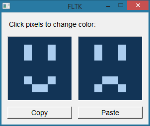

This project demonstrates some issues with copying and pasting graphics in FLTK 1.3.5 with `FL_ABI_VERSION` 10305.

It presents two canvases, and buttons to Copy and Paste.

- Click a pixel on either canvas to change its color.
- Click Copy or press Ctrl+C to copy from the left canvas.
- Click Paste or press Ctrl+V to paste onto the right canvas.

I have observed two system-specific issues with this program:

- On Windows (8 and 10 tested), pasting from this program to [paint.net](https://www.getpaint.net/) adds an extra translucent rightmost column and bottommost row. This also happens with FLTK's `device` test program. It does not happen with other editors I've tried, including MS Paint and GIMP.
- On Linux (Xubuntu and Slackware tested), copying and then pasting in this program does not work: `Fl::clipboard_contains(Fl::clipboard_image)` returns `false`. Copying from a separate editor to this program does work, including Pinta and GIMP. The `copy_source` function is based on the usage example from the [`Fl_Copy_Surface` documentation](https://www.fltk.org/doc-1.3/classFl__Copy__Surface.html).
